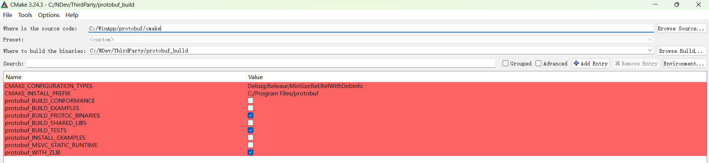

## XVisual       
[简体中文](README-CN.md) | [English](README.md)                   
          
## LOGO        
<p align="center">
  
</p>
             
## SLOGAN              
<p style="text-align: center; font-size: 26px; font-weight: bold;">                   
Simplify Code, Enhance AI                   
</p>                   
                   
## Introduction          
这是利用Qt-CPP编写的一个可视化搭建视觉任务的平台                    
- 可扩展性:     
    - 只用重写几个简单虚函数即可实现功能扩展       
- 定制化：        
    - 可以根据需求自定义算法         
- 解耦性:          
    - 界面代码和算法逻辑代码没有强关联性           
- 迁移性强：          
    - 虽然用户交互部分依赖于Qt, 但导出的解决方案(不依赖于任何Qt库)可以应用到C#等其它平台                  
- 可视化：            
    - 所见即所得, 解决方案搭建过程可视化, 掌控中间节点的每一个输出                     
                    
## Requirements       
在开始之前，请确保安装和配置 Qt、OpenCV、gflags、glog、protobuf、TensorFlow 2.9.3 C++ 库。        
        
### Qt        
建议下载的 `Qt` 版本是 `Qt 4.6.2` 版本, 因为 `XVisual` 项目是在 `Qt 4.6.2` 上开发、测试的;                                 
下载地址是 [Qt 4.6.2](https://download.qt.io/archive/online_installers/4.5/qt-unified-windows-x64-4.5.1-online.exe)          
必须安装的组件是：core, gui, widgets          
        
### OpenCV        
访问 [OpenCV 的 GitHub 发布页面](https://github.com/opencv/opencv/releases)，下载Windows自解压文件, 如 [opencv-4.4.0-vc14_vc15.exe](https://github.com/opencv/opencv/releases/download/4.4.0/opencv-4.4.0-vc14_vc15.exe)。          
解压下载的文件到你选择的目录 `%Path_to_OpenCV%`，例如：`C:\OpenCV`。          
将路径 `%Path_to_OpenCV%\build\x64\vc15\bin` 添加到 `环境变量` -----> `系统环境变量` -----> `Path 变量`                          
                
### gflags         
It is necessary to ensure that `gflags` are configured and installed before configuring and installing `glog`, Because `gflags` is a dependency of `glog`.   
在配置和安装 `glog` 之前，必须确保 `gflags` 已经配置和安装。因为 `gflags` 是 `glog` 的依赖项。          
<details>
<summary><b>这里给出安装配置 gflags 的具体步骤</b></summary>     
        
#### 1. 获取 gflags 源代码    
git clone https://github.com/gflags/gflags.git     
#### 2. 配置和生成 `gflags.sln`    
在 CMake Gui 里面使用 Visual Studio 2019 Compiler 配置和生成 `gflags.sln`            
关于配置、生成 `glags` 的具体步骤, 请参考这篇 blog [https://blog.csdn.net/OOFFrankDura/article/details/103587306]        
#### 3. 已编译的 gflags 库        
另一种方式是下载 `XVisual` 项目作者编译好的 `gflags` library        
[gflags library for Windows on GoogleDrive](https://drive.google.com/file/d/1IMsBhb1klc9xDPUo6LcoFMQRUxYccAD3/view?usp=drive_link)             
[gflags library for Windows on BaiduYunDrive](https://pan.baidu.com/s/1a2aE8bsVQFbobrdKuV7EKQ?pwd=97hi) 提取码：97hi                                 
大小: 332603 字节 (324 KiB)        
SHA256: E72F9BF307FEA9555E257C440B6C695BE051731AC651C78A44CB06027B664573     
#### 4. 编写 gflags 属性表          
这里假设 `gflags` library 的路径是 `%Path_to_gflags%`                  
``` json      
<?xml version="1.0" encoding="utf-8"?>
<Project ToolsVersion="4.0" xmlns="http://schemas.microsoft.com/developer/msbuild/2003">
  <ImportGroup Label="PropertySheets" />
  <PropertyGroup Label="UserMacros" />
  <PropertyGroup>
    <ExecutablePath>%Path_to_gflags%\bin;$(ExecutablePath)</ExecutablePath>
    <IncludePath>%Path_to_gflags%\include;$(IncludePath)</IncludePath>
    <LibraryPath>%Path_to_gflags%\lib;$(LibraryPath)</LibraryPath>
  </PropertyGroup>
  <ItemDefinitionGroup>
    <Link>
      <AdditionalDependencies>gflags_nothreads.lib;gflags.lib;%(AdditionalDependencies)</AdditionalDependencies>
    </Link>
  </ItemDefinitionGroup>
  <ItemGroup />
</Project>
```          
我的 `%Path_to_gflags%` 对应的实际路径是 `C:\Program Files (x86)\gflags`        
那么真实的属性表就是：                              
``` json 
<?xml version="1.0" encoding="utf-8"?>
<Project ToolsVersion="4.0" xmlns="http://schemas.microsoft.com/developer/msbuild/2003">
  <ImportGroup Label="PropertySheets" />
  <PropertyGroup Label="UserMacros" />
  <PropertyGroup>
    <ExecutablePath>C:\Program Files (x86)\gflags\bin;$(ExecutablePath)</ExecutablePath>
    <IncludePath>C:\Program Files (x86)\gflags\include;$(IncludePath)</IncludePath>
    <LibraryPath>C:\Program Files (x86)\gflags\lib;$(LibraryPath)</LibraryPath>
  </PropertyGroup>
  <ItemDefinitionGroup>
    <Link>
      <AdditionalDependencies>gflags_nothreads.lib;gflags.lib;%(AdditionalDependencies)</AdditionalDependencies>
    </Link>
  </ItemDefinitionGroup>
  <ItemGroup />
</Project>
```         
Notes: 以上給出的属性表是 release 模式的示范，如果需要 debug 模式，需要将 `gflags_nothreads.lib` 和 `gflags.lib` 分别替换为 `gflags_nothreads_debug.lib` 和 `gflags_debug.lib`                           
</details>
                
### glog   
<details>
<summary><b>这里给出安装配置 glog 的具体步骤</b></summary>     
           
#### 1. 获取 glog 源代码
git clone https://github.com/google/glog.git      
#### 2. 配置生成 `glog.sln` 
在 CMake Gui 里面使用 Visual Studio 2019 Compiler 配置和生成 `glog.sln`   
请查阅这篇博客 [https://blog.csdn.net/m0_37829462/article/details/124695715] 了解关于 `glog` 配置、安装的具体步骤。      
#### 3. 已编译好的 glog 库
`XVisual` 项目作者编译好的 `glog` library 可以从以下链接获取：       
[glog library for Windows on GoogleDrive](https://drive.google.com/file/d/18peDb485trUK1m_yuULx1TjPLr11WrLa/view?usp=drive_link)         
[glog library for Windows on BaiduYunDrive](https://pan.baidu.com/s/1clADI0bi6-VLXgKw6r6EWA?pwd=djff), 提取码：djff          
大小: 264773 字节 (258 KiB)              
SHA256: B166AE4E73278CF99915945A7A7EBF03106015A10DD63116A19BE2C42F3245B7             
                 
#### 4. 编写 glog 属性表          
这里假设 `glog` library 的路径是 `%Path_to_glog%`           
```          
<?xml version="1.0" encoding="utf-8"?>
<Project ToolsVersion="4.0" xmlns="http://schemas.microsoft.com/developer/msbuild/2003">
  <ImportGroup Label="PropertySheets" />
  <PropertyGroup Label="UserMacros" />
  <PropertyGroup>
    <IncludePath>%Path_to_glog%\include;$(IncludePath)</IncludePath>
    <LibraryPath>%Path_to_glog%\lib;$(LibraryPath)</LibraryPath>
    <ExecutablePath>%Path_to_glog%\bin;$(ExecutablePath)</ExecutablePath>
  </PropertyGroup>
  <ItemDefinitionGroup>
    <Link>
      <AdditionalDependencies>glog.lib;%(AdditionalDependencies)</AdditionalDependencies>
    </Link>
  </ItemDefinitionGroup>
  <ItemGroup />
</Project>
```            
我的 `%Path_to_glog%` 对应的实际路径是 `C:\Program Files (x86)\glog`        
那么真实的属性表就是：         
```          
<?xml version="1.0" encoding="utf-8"?>
<Project ToolsVersion="4.0" xmlns="http://schemas.microsoft.com/developer/msbuild/2003">
  <ImportGroup Label="PropertySheets" />
  <PropertyGroup Label="UserMacros" />
  <PropertyGroup>
    <IncludePath>C:\Program Files (x86)\glog\include;$(IncludePath)</IncludePath>
    <LibraryPath>C:\Program Files (x86)\glog\lib;$(LibraryPath)</LibraryPath>
    <ExecutablePath>C:\Program Files (x86)\glog\bin;$(ExecutablePath)</ExecutablePath>
  </PropertyGroup>
  <ItemDefinitionGroup>
    <Link>
      <AdditionalDependencies>glog.lib;%(AdditionalDependencies)</AdditionalDependencies>
    </Link>
  </ItemDefinitionGroup>
  <ItemGroup />
</Project>
```            
Notes: 以上給出的属性表是 release 模式的示范，如果需要 debug 模式，需要将 `glog.lib` 替换为 `glogd.lib`                      
</details>
          
### protobuf   
TensorFlow 2.x library 的运行依赖于 `libprotobuf.lib`, `libprotoc.lib`, `protoc.exe`, 所以编译 `protobuf` 至关重要        
<details>
<summary><b>以下是配置和构建 protobuf 库的详细说明</b></summary>  
              
在配置 `protobuf` 时，请将 `protobuf_MSVC_STATIC_RUNTIME` 设置为 false, 确保 `protobuf` 使用动态链接的 CRT (C RunTime Library)  
   
The already compiled protobuf library provided by the author of this repository can be accquired from   
`XVisual` 项目作者提供的已编译好的 `protobuf` library 可以从如下链接地址获取:            
[protobuf library for Windows on GoogleDrive](https://drive.google.com/file/d/1hd9U7eu846CZYLC6Sa2FXNsKGTUGOwKX/view?usp=drive_link)             
[protobuf library for Windows on BaiduYunDrive](https://pan.baidu.com/s/1nAEikqxuFa-vMHxfA16NtQ?pwd=pjdg), 提取码：pjdg           
大小: 7162701 字节 (6994 KiB)               
SHA256: 2AFE7E67D14CFD6878B176B4A6613254249856F1AC85C7E7A1DE3F3EDF7A061A                  
Notes: 解压后只有三个文件，它们分别是：`libprotobuf.lib`, `libprotoc.lib`, `protoc.exe`                       
Notes: 为了方便在 tensorflow 2.x library 属性表配置中引用 protobuf 库, 用 `%Path_to_protobuf_library%` 标记 protobuf 库的路径, 
并且在本指南中, 我的 `%Path_to_protobuf_library%` 对应的真实路径是 `C:\NDev\ThirdParty\protobuf_build\Release`      
</details>            
               
### tensorflow 2.x library for CPP on Windows    
编译 TensorFlow CPP library 是极其耗费心力的，  
并且有![证据] (https://github.com/tensorflow/tensorflow/issues/61226) 表明 Tensorflow 2.10.0 及其之后的版本是不支持 native windows c++ compile 的。                   
<details>
<summary><b>这里以 `tensorflow 2.9.3` 为例为您演示具体步骤</b></summary>
             
#### 1. 安装配置好 CUDA 和 CUDNN            
推荐安装的 CUDA/cuDNN version 是：            
    - cuDNN 8.1 for Cuda 11.2          
具体安装包名称是：     
`cuda_11.2.0_460.89_win10.exe`             
`cudnn-11.2-windows-x64-v8.1.0.77.zip`           
                
#### 2. git clone `tensorflow-2.9.3`            
`git clone -b v2.9.3 https://github.com/tensorflow/tensorflow.git`                 
这里假设 `tensorflow-2.9.3` 存放地址是 `%Path_to_tensorflow-2.9.3%`, 并且假设实际地址是 `D:\NDev\tensorflow-2.9.3`, 并以此做说明。             
          
#### 3. Download `bazel-5.4.1`                
`%Path_to_tensorflow-2.9.3%` 目录下的 `configure.py` 文件里面包含有如下内容：                        
    ``` python 
    _TF_MIN_BAZEL_VERSION = '4.2.2'
    _TF_MAX_BAZEL_VERSION = '5.99.0'
    ```         
    表示支持的 `bazel` 版本是 4.2.2~5.99.0, 但这里推荐采用 5.4.1                  
    下载 [bazel-5.4.1](https://github.com/bazelbuild/bazel/releases/download/5.4.1/bazel-5.4.1-windows-x86_64.exe)                    
    存放到本地 `%Path_to_Bazel_binary%`, 在此目录下仅有一个 `bazel-5.4.1-windows-x86_64.exe` 文件，将这个 `bazel-5.4.1-windows-x86_64.exe` 文件重命名为 `bazel.exe`。       
    再将路径 `%Path_to_Bazel_binary%` 添加到 `环境变量` -----> `系统环境变量` -----> `Path 变量`               
                  
#### 4.  在 `.bazelrc` 文件里面修改 tensorflow 构建的输出路径          
在执行 bazel build 命令之前, 可能需要修改 tensorflow 构建的输出路径。          
如果您的 C 盘空间不充足, 则有必要修改 tensorflow 构建的输出路径。打开 `%Path_to_tensorflow-2.9.3%` 目录下的 `.bazelrc` 文件, 在该文件的末尾添加如下内容:        
`startup --output_user_root=%Path_to_tf293_build_output%`                  
对于以上展示出来的命令行, 等号右边的 `%Path_to_tf293_build_output%` 是您为 `tensorflow 构建的输出路径` 指定的具体的真实路径。             
比如，我的 `%Path_to_tf293_build_output%` 对应的实际路径是 `D:/NDev/tf293_build`               
            
#### 5. 安装 MSYS2           
安装 `MSYS2`，以获取构建 `TensorFlow` 所需的 bin 工具。如果 `MSYS2` 已安装到 `C:\msys64` 下，请将 `C:\msys64\usr\bin` 添加到系统环境变量 `%PATH%` 中。
然后，使用 `cmd.exe` 运行以下命令: 
    ``` bash 
    pacman -S git patch unzip
    ```
             
#### 6. 安装 Visual C++ 生成工具 2019 或者 Visual Studio 2019              
有关详情请参考 https://www.tensorflow.org/install/source_windows?hl=zh-cn#install_visual_c_build_tools_2019           
          
#### 7. 配置 build               
切换路径并转到 `%Path_to_tensorflow-2.9.3%`                
我的 `%Path_to_tensorflow-2.9.3%` 对应的真实路径是 `D:\NDev\tensorflow-2.9.3`             
执行如下命令:           
`python ./configure.py`             
具体如何操作可以参考 [issues 62688](https://github.com/tensorflow/tensorflow/issues/62688)          
            
#### 8. 认识以 `bazel build` 打头的三条命令            
在 Windows 平台编译 tensorflow 2.x  CPP library 主要涉及 *.dll 的编译、*.lib 的编译、头文件安装三个方面, 具体命令如下：            
编译 tensorflow 2.x  CPP library 的 tensorflow_cc.dll 的命令是：           
`bazel build --config=opt --config=cuda --define=no_tensorflow_py_deps=true --copt=-nvcc_options=disable-warnings --local_ram_resources=2048 //tensorflow:tensorflow_cc.dll`              
编译 tensorflow 2.x  CPP library 的 tensorflow_cc.lib 的命令是：              
`bazel build --config=opt --config=cuda --define=no_tensorflow_py_deps=true --copt=-nvcc_options=disable-warnings --local_ram_resources=2048 //tensorflow:tensorflow_cc_dll_import_lib`                
安装 tensorflow 2.x  CPP library 的头文件的命令是:                   
`bazel build --config=opt --config=cuda --define=no_tensorflow_py_deps=true --copt=-nvcc_options=disable-warnings --local_ram_resources=2048 //tensorflow:install_headers`             
最终编译好的 `tensorflow_cc.dll`, `tensorflow_cc.lib`, `include` 文件夹都位于 `%Path_to_tf293_build_output%`                  
特别提醒：如果计算机资源受限，可以使用 `--local_ram_resources` 限制内存用量              
           
#### 9. 编译完成后在 `%Path_to_tensorflow-2.9.3%` 目录出现 `bazel-bin`、`bazel-out`、`bazel-tensorflow-2.9.3`、`bazel-testlogs` 这4个文件夹
并且 `tensorflow_cc.dll`, `tensorflow_cc.lib`, `include` 出现在 `bazel-bin/tensorflow` 目录之下:
    ``` bash          
    bazel-bin/tensorflow/           
    bazel-bin/tensorflow/tensorflow_cc.dll               
    bazel-bin/tensorflow/tensorflow_cc.lib            
    bazel-bin/tensorflow/include             
    ```              
    注意这些文件夹 `bazel-bin`, `bazel-out`, `bazel-tensorflow-2.9.3`, `bazel-testlogs` 是符号链接，文件夹的实际位置并不在 `%Path_to_tensorflow-2.9.3%` 目录下，可以用以下命令列举出这些文件夹的实际位置:             
    ``` bash          
    dir bazel-*             
    ```              
    列举出这些文件夹的实际位置如下：                 
    ``` bash             
    2023/12/21  14:13    <JUNCTION>     bazel-bin [D:\ndev\tf293_build\hu3sahy6\execroot\org_tensorflow\bazel-out\x64_windows-opt\bin]             
    2023/12/21  14:13    <JUNCTION>     bazel-out [D:\ndev\tf293_build\hu3sahy6\execroot\org_tensorflow\bazel-out]             
    2023/12/21  14:13    <JUNCTION>     bazel-tensorflow-2.9.3 [D:\ndev\tf293_build\hu3sahy6\execroot\org_tensorflow]             
    2023/12/21  14:13    <JUNCTION>     bazel-testlogs [D:\ndev\tf293_build\hu3sahy6\execroot\org_tensorflow\bazel-out\x64_windows-opt\testlogs]             
    ```             
    注意: 我的 `%Path_to_tf293_build_output%` 对应的真实路径是 `D:\ndev\tf293_build`, 请自行对应你的文件夹的实际位置                    
                 
#### 10. 将 `tensorflow_cc.dll`, `tensorflow_cc.lib`, `include` 归并到一起另存到 `%Path_to_tf2.9.3_cpp_library%` 目录, 以便后续编码使用             
                  
#### 11. `XVisual` 项目作者提供的编译好的 tensorflow 2.9.3 c++ library 可以从如下网络链接获取:                   
[tensorflow 2.9.3 c++ libaray for Windows on GoogleDrive](https://drive.google.com/file/d/1AZkcrGzzM8fk6ocLIMvFBkVZaItZJ3oY/view?usp=drive_link)           
[tensorflow 2.9.3 c++ libaray for Windows on BaiduYunDrive](https://pan.baidu.com/s/1CILBcTwKygBkrH6S8r3GnQ?pwd=a6l5), 提取码：a6l5                   
大小: 194842091 字节 (185 MiB)        
SHA256: EE5366FBE4E79D33FA5DF91155EA0DD1A05F315190F00E75D03BABCB7A025BA4          
          
#### 12. 编写属性表方便通过 Visual Studio 2019 调用 tensorflow 2.9.3 c++ library                            
这里做如下假设：                            
protobuf 库放置在 `%Path_to_protobuf_library%`                            
tensorflow 库放置在 `%Path_to_tf2.9.3_cpp_library%`                            
则有如下属性表, 记作 `tf2.9.3_template_release.props`:                            
``` json 
<?xml version="1.0" encoding="utf-8"?>
<Project ToolsVersion="4.0" xmlns="http://schemas.microsoft.com/developer/msbuild/2003">
  <ImportGroup Label="PropertySheets" />
  <PropertyGroup Label="UserMacros" />
  <PropertyGroup>
    <LibraryPath>%Path_to_protobuf_library%;%Path_to_tf2.9.3_cpp_library%;$(LibraryPath)</LibraryPath>
    <IncludePath>%Path_to_tf2.9.3_cpp_library%\include;%Path_to_tf2.9.3_cpp_library%\include\src;$(IncludePath)</IncludePath>
  </PropertyGroup>
  <ItemDefinitionGroup>
    <Link>
      <AdditionalDependencies>libprotoc.lib;libprotobuf.lib;tensorflow_cc.lib;%(AdditionalDependencies)</AdditionalDependencies>
    </Link>
  </ItemDefinitionGroup>
  <ItemGroup />
</Project>
```            
如果我的`%Path_to_protobuf_library%`对应的是 `C:\NDev\ThirdParty\protobuf_build\Release`, 我的`Path_to_tf2.9.3_cpp_library%`对应的是 `C:\AIDev\tf293_py391_Bazel541_OK`                
那么, 将`tf2.9.3_template_release.props`属性表里面的路径替换为真实路径,  就有如下属性表, 记作 `tf2.9.3_release.props`:                      
``` json 
<?xml version="1.0" encoding="utf-8"?>
<Project ToolsVersion="4.0" xmlns="http://schemas.microsoft.com/developer/msbuild/2003">
  <ImportGroup Label="PropertySheets" />
  <PropertyGroup Label="UserMacros" />
  <PropertyGroup>
    <LibraryPath>C:\NDev\ThirdParty\protobuf_build\Release;C:\AIDev\tf293_py391_Bazel541_OK;$(LibraryPath)</LibraryPath>
    <IncludePath>C:\AIDev\tf293_py391_Bazel541_OK\include;C:\AIDev\tf293_py391_Bazel541_OK\include\src;$(IncludePath)</IncludePath>
  </PropertyGroup>
  <ItemDefinitionGroup>
    <Link>
      <AdditionalDependencies>libprotoc.lib;libprotobuf.lib;tensorflow_cc.lib;%(AdditionalDependencies)</AdditionalDependencies>
    </Link>
  </ItemDefinitionGroup>
  <ItemGroup />
</Project>
```         
              
#### 13. tensorflow 编译参考资料       
[build tensorflow from source code on Windows](https://www.tensorflow.org/install/source_windows)               
[Windows10 Bazel 编译 Tensorflow 2 C++ dll 和 lib 文件-CSDN博客](https://blog.csdn.net/yx123919804/article/details/107042822)              
[Windows 10 环境从源码编译构建 TensorFlow 2.5.0 (GPU) - 知乎 (zhihu.com)](https://zhuanlan.zhihu.com/p/410757318)              
[CUDA GPUs - Compute Capability | NVIDIA Developer](https://developer.nvidia.com/cuda-gpus)              
[hidon/Tensorflow-to-C- (github.com)](https://github.com/hidon/Tensorflow-to-C-)              
                     
</details>
              
## Quick start                
The `XVisual_Release_Express_Experience` can be downloaded from the following link for an express experience          
[XVisual_Release_Express_Experience for Windows on GoogleDrive](https://drive.google.com/file/d/1tOhYaEC4DyUFWYEBY_DwjnOpOUxskUCW/view?usp=drive_link)             
[XVisual_Release_Express_Experience for Windows on BaiduYunDrive](https://pan.baidu.com/s/1xBKuozoNEvrO4QXT7ZL1Ng?pwd=3moo), 提取码: 3moo                    
大小: 844217894 字节 (805 MiB)             
SHA256: 14C47B9D126C94581A5AF131B1425A6AFF712A61673B8029F5BA40993BF1F3C3              
当前可直接体验的功能点有:              
1. 导入已完成的解决方案 solutions.json，加载显示，执行计算逻辑，显示相关结果               
              
2. 构建一个解决方案              
              
              
## How Does XVisual Works        
```         
       Colleague      XInfer     
     /          \     /     
    Item  --->  Handle     
    /   \       /    
loader   XParser      
    \    /           
     json    
```     
- Item 负责界面显示和用户交互, Handle 负责算法逻辑。      
- Item 可以处理的事务逻辑包含图像路径选择、RoI设置、AI算法模型选择等。      
- Handle 可以处理的算法逻辑包含传统算法、AI算法、视觉算法、2D算法、3D算法、NLP算法、音视频算法等。       
- Item 和 Handle 都是 `Colleague` 的孩子。      
- Item 和 Handle 加载或解析的数据都以 json 的形式存储。        
- XInfer 负责整个解决方案的加载和推理, 但不依赖于Qt或C#等Gui。       
              
## Customized                
How to add custom handles and items                 
1. 继承 XBaseItem 并重写几个函数                   
               
2. 继承 XBaseHandle 并重写几个函数               
               
3. 在 XBaseHandle.h 添加 friend class 声明               
               
4. 在 MainWindow.cpp 添加 item         
          
## Terminology interpretation         
           
| Handle Name | Meanings | Sources | Dests | innerParam | Other statements |
|-----:|-----------| -----------| -----------|-----------|-----------|
| LoadImage   | 加载图像  |  imagePath : std::string  | image : cv::Mat | ************** | ************** |
| CVCrop   |  裁剪图像   | image : cv::Mat     | croppedImage : cv::Mat   | roi : cv::Rect | ************** |
| ImagePre   | 图像预处理  | image : cv::Mat     | outputImage : cv::Mat,  outputParam : PreParam   | ************** | ************** |
| PreInver | 还原被预处理的图像  | image : cv::Mat,  preParam : PreParam  | restoredImage : cv::Mat   | ************** | ************** |
| RevertBox   | 将检测输出的Boxes还原到原始图像的尺度空间   | detectResults : std::vector<DetectResult>, preParam : PreParam    | detections : std::vector<DetectResult>   | ************** | ************** |
| DrawBox   | 将检测结果画在图像上  | image : cv::Mat, detections : std::vector<DetectResult>, `classNames : std::vector<std::string>`  | resultImage : cv::Mat  | ************** | ************** |
| TFDetect   | 基于 TensorFlow 2.x 的目标检测 | image : cv::Mat, detections : std::vector<DetectResult>, `classNames : std::vector<std::string>`  | resultImage : cv::Mat  |************** | 目标检测模型必须以saved_model的形式提供, 且必须提供classnames.txt以便读取class names |
            
<b>**Notes:**</b>                 
- Sources 维护 Handle 的输入, Dests 维护 Handle 的输出, innerParam 维护 Handle 的 内部参数;                
- 以名为 `CVCrop` 的 Handle 为例说明, 它的 `Sources` 是 `image : cv::Mat`, 表示有且仅有 `cv::Mat` 类型且名为 `image` 的输入变量一个, 冒号前面表示输入变量名称, 冒号后面表示输入变量类型;                    
- 以名为 `ImagePre` 的 Handle 为例说明, 它的 `Dests` 是 `outputImage : cv::Mat,  outputParam : PreParam`, 这里用逗号分割了多个 `输入变量名称:输入变量类型`;             
- 如果某个 Handle 不存在 innerParam, 则在对应栏用 `*` 填充, 比如名为 `LoadImage` 的 Handle, 第一行的倒数第二列是用 `*` 填充的。                                        
              
## License             
本项目采用 MIT 许可条款及附加条款。详情请参见 [LICENSE](./LICENSE-CN) 文件。              
如需用于商业用途，请联系 `lihenghe93@gmail.com` 获取商业许可。          
              
## Citation           
@misc{XVisual,            
    author = {Liheng He},                    
    title = {XVisual, this is a platform for visually building computer vision tasks, written in Qt-C++},                  
    howpublished = {Github},                     
    year = {2024},                                
    url = {https://github.com/tricoffee/XVisual}                   
}            
                                
## Donation           
如果您觉得这个项目对您有帮助，请考虑打赏以支持项目的持续开发和维护。您的支持将有助于更好地改进和扩展这个项目。               
您可以通过以下方式进行打赏：                 
- 微信          
         
- 支付宝          
             
         
## 技术支持与商业合作          
如果您在使用本项目的过程中遇到任何问题，或者有商业合作的意向，请随时通过以下方式取得联系：        
- **电子邮件**: [lihenghe93@gmail.com](mailto:lihenghe93@gmail.com)         
非常期待与您的合作！            
              
## Status      
`OnGoing`
              
## Task Progress   
| Task | Progress |
|-----:|-----------|
| 2D   | OnGoing   |
| 3D   | ToDo      |
| OCR  | ToDo      |
