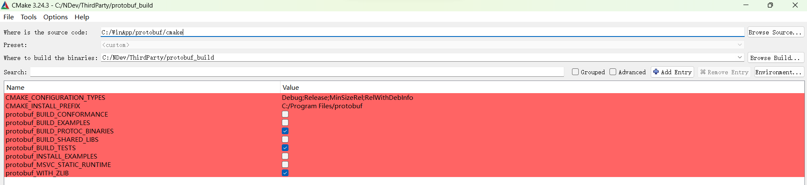

## XVisual       
[English](README.md) | [简体中文](README-CN.md)         
          
## LOGO  
<p align="center">
  
</p>
            
## SLOGAN              
<p style="text-align: center; font-size: 26px; font-weight: bold;">                   
Simplify Code, Enhance AI                   
</p>                   
                   
## Introduction      
This is a platform for visually building computer vision tasks, written in Qt-C++.          
- Scalability:             
    - Functionality can be extended by simply overriding a few virtual functions.             
- Customization:             
    - Algorithms can be customized according to requirements.             
- Decoupling:             
    - Interface code and algorithm logic code are not strongly coupled.             
- High Portability:             
    - Although the user interaction part depends on Qt, the exported solution (which does not depend on any Qt library) can be applied to other platforms like C#.             
- Visualization:             
    - What you see is what you get; the solution building process is visualized, allowing control over every output at intermediate nodes.                             
                    
## Requirements   
Before starting, please make sure to install and configure Qt, OpenCV, gflags, glog, protobuf, tensorflow 2.9.3 C++ library     
          
### Qt          
The recommended Qt version to download is `Qt 4.6.2`, as the `XVisual` project was developed and tested on `Qt 4.6.2`.             
The download link is  [Qt 4.6.2](https://download.qt.io/archive/online_installers/4.5/qt-unified-windows-x64-4.5.1-online.exe)             
The required components to install are: core, gui, widgets.                  
      
### OpenCV                 
Go to [the OpenCV GitHub releases page](https://github.com/opencv/opencv/releases), download the self-extracting file (e.g., opencv-4.x.x-vc14_vc15.exe).                
Extract the downloaded file to your chosen directory `%Path_to_OpenCV%`, e.g., `C:\OpenCV`.              
Add the path `%Path_to_OpenCV%\build\x64\vc15\bin` to `the Environment Variables` -----> `System Variables` -----> `Path Variable`                    
                
### gflags          
It is necessary to ensure that `gflags` are configured and installed before configuring and installing `glog`, Because `gflags` is a dependency of `glog`.     
<details>
<summary><b>Here are the concrete steps for configuring and installing gflags</b></summary>  
              
#### 1. acquire source code of `gflags`     
git clone https://github.com/gflags/gflags.git     
#### 2. configure and generate `gflags.sln`      
configure and generate `gflags.sln` with Visual Studio 2019 Compiler in CMake Gui      
For detailed steps on gflags configuration and installation, please refer to this blog link [https://blog.csdn.net/OOFFrankDura/article/details/103587306]     
#### 3. access to the already compiled `gflags` library    
Another optional way is to download the already compiled `gflags` library provided by the author of the `XVisual` repository.      
[gflags library for Windows on GoogleDrive](https://drive.google.com/file/d/1IMsBhb1klc9xDPUo6LcoFMQRUxYccAD3/view?usp=drive_link)               
[gflags library for Windows on BaiduYunDrive](https://pan.baidu.com/s/1a2aE8bsVQFbobrdKuV7EKQ?pwd=97hi), extraction code：97hi                                  
Size: 332603 bytes (324 KiB)               
SHA256: E72F9BF307FEA9555E257C440B6C695BE051731AC651C78A44CB06027B664573           
#### 4. Create a property sheet to facilitate calling the gflags library through Visual Studio 2019             
Assuming that the path to the `gflags` library is `%Path_to_gflags%`         
``` json     
<?xml version="1.0" encoding="utf-8"?>
<Project ToolsVersion="4.0" xmlns="http://schemas.microsoft.com/developer/msbuild/2003">
  <ImportGroup Label="PropertySheets" />
  <PropertyGroup Label="UserMacros" />
  <PropertyGroup>
    <ExecutablePath>%Path_to_gflags%\bin;$(ExecutablePath)</ExecutablePath>
    <IncludePath>%Path_to_gflags%\include;$(IncludePath)</IncludePath>
    <LibraryPath>%Path_to_gflags%\lib;$(LibraryPath)</LibraryPath>
  </PropertyGroup>
  <ItemDefinitionGroup>
    <Link>
      <AdditionalDependencies>gflags_nothreads.lib;gflags.lib;%(AdditionalDependencies)</AdditionalDependencies>
    </Link>
  </ItemDefinitionGroup>
  <ItemGroup />
</Project>
```      
The actual path corresponding to my `%Path_to_gflags%` is `C:\Program Files (x86)\gflags`               
So the real property sheet is :       
``` json 
<?xml version="1.0" encoding="utf-8"?>
<Project ToolsVersion="4.0" xmlns="http://schemas.microsoft.com/developer/msbuild/2003">
  <ImportGroup Label="PropertySheets" />
  <PropertyGroup Label="UserMacros" />
  <PropertyGroup>
    <ExecutablePath>C:\Program Files (x86)\gflags\bin;$(ExecutablePath)</ExecutablePath>
    <IncludePath>C:\Program Files (x86)\gflags\include;$(IncludePath)</IncludePath>
    <LibraryPath>C:\Program Files (x86)\gflags\lib;$(LibraryPath)</LibraryPath>
  </PropertyGroup>
  <ItemDefinitionGroup>
    <Link>
      <AdditionalDependencies>gflags_nothreads.lib;gflags.lib;%(AdditionalDependencies)</AdditionalDependencies>
    </Link>
  </ItemDefinitionGroup>
  <ItemGroup />
</Project>
```         
Notes: The property sheet provided above is an example in the release mode. If debugging mode is required, replace `gflags_nothreads.lib` and `gflags.lib` with `gflags_nothreads_debug.lib` and `gflags_debug.lib` respectively.              
</details>                  
      
### glog   
<details>   
<summary><b>Here are the concrete steps for configuring and installing gflog</b></summary>     
         
#### 1. acquire source code of `glog`        
git clone https://github.com/google/glog.git           
#### 2. configure and generate `glog.sln`       
configure and generate `glog.sln` with Visual Studio 2019 Compiler in CMake Gui   
Refer to this blog [https://blog.csdn.net/m0_37829462/article/details/124695715] for detailed steps on glog configuration and installation.       
#### 3. access to the already compiled `glog` library         
The already compiled `glog` library provided by the author of the `XVisual` project repository can be accessed by      
[glog library for Windows on GoogleDrive](https://drive.google.com/file/d/18peDb485trUK1m_yuULx1TjPLr11WrLa/view?usp=drive_link)   
[glog library for Windows on BaiduYunDrive](https://pan.baidu.com/s/1clADI0bi6-VLXgKw6r6EWA?pwd=djff), extraction code：djff           
Size: 264773 bytes (258 KiB)              
SHA256: B166AE4E73278CF99915945A7A7EBF03106015A10DD63116A19BE2C42F3245B7               

#### 4. Create a property sheet to facilitate calling the glog library through Visual Studio 2019   
Assuming that the path to the `glog` library is `%Path_to_glog%`      
```          
<?xml version="1.0" encoding="utf-8"?>
<Project ToolsVersion="4.0" xmlns="http://schemas.microsoft.com/developer/msbuild/2003">
  <ImportGroup Label="PropertySheets" />
  <PropertyGroup Label="UserMacros" />
  <PropertyGroup>
    <IncludePath>%Path_to_glog%\include;$(IncludePath)</IncludePath>
    <LibraryPath>%Path_to_glog%\lib;$(LibraryPath)</LibraryPath>
    <ExecutablePath>%Path_to_glog%\bin;$(ExecutablePath)</ExecutablePath>
  </PropertyGroup>
  <ItemDefinitionGroup>
    <Link>
      <AdditionalDependencies>glog.lib;%(AdditionalDependencies)</AdditionalDependencies>
    </Link>
  </ItemDefinitionGroup>
  <ItemGroup />
</Project>
```   
The actual path corresponding to my `%Path_to_glog%` is `C:\Program Files (x86)\glog`               
So the real property sheet is :   
```          
<?xml version="1.0" encoding="utf-8"?>
<Project ToolsVersion="4.0" xmlns="http://schemas.microsoft.com/developer/msbuild/2003">
  <ImportGroup Label="PropertySheets" />
  <PropertyGroup Label="UserMacros" />
  <PropertyGroup>
    <IncludePath>C:\Program Files (x86)\glog\include;$(IncludePath)</IncludePath>
    <LibraryPath>C:\Program Files (x86)\glog\lib;$(LibraryPath)</LibraryPath>
    <ExecutablePath>C:\Program Files (x86)\glog\bin;$(ExecutablePath)</ExecutablePath>
  </PropertyGroup>
  <ItemDefinitionGroup>
    <Link>
      <AdditionalDependencies>glog.lib;%(AdditionalDependencies)</AdditionalDependencies>
    </Link>
  </ItemDefinitionGroup>
  <ItemGroup />
</Project>
```      
Notes: The property sheet provided above is an example in the release mode. If debugging mode is required, replace `glog.lib` with `glogd.lib` respectively.              
</details>
   
### protobuf   
The TensorFlow 2.x C++ library depends on `libprotobuf.lib`, `libprotoc.lib`, `protoc.exe`, so it is necessary to compile `protobuf`      
<details>
<summary><b>Here are the detailed descriptions for configuring and build protobuf library</b></summary>  
              
When configuring `protobuf`, please set `protobuf-MSVC-STATIC-RUNTIME` to false to ensure that `protobuf` uses dynamically linked CRT (C RunTime Library)   
   
The already compiled `protobuf` library provided by the author of the `XVisual` repository can be accquired from   
[protobuf library for Windows on GoogleDrive](https://drive.google.com/file/d/1hd9U7eu846CZYLC6Sa2FXNsKGTUGOwKX/view?usp=drive_link)             
[protobuf library for Windows on BaiduYunDrive](https://pan.baidu.com/s/1nAEikqxuFa-vMHxfA16NtQ?pwd=pjdg), extraction code：pjdg                      
Size: 7162701 bytes (6994 KiB)               
SHA256: 2AFE7E67D14CFD6878B176B4A6613254249856F1AC85C7E7A1DE3F3EDF7A061A                  
Notes: after decompression there are only three files `libprotobuf.lib`, `libprotoc.lib`, `protoc.exe`                           
Notes: In order to refer to the protobuf library in the tensorflow 2.x library property sheet configuration, the path to the protobuf library is marked with `%Path_to_protobuf_library%`. 
And in this guide, my `%Path_to_protobuf_library%` corresponds to the real path `C:\NDev\ThirdParty\protobuf_build\Release`.          
</details>            
              
### tensorflow 2.x library for CPP on Windows    
Compiling the TensorFlow CPP library is extremely labor-intensive.       
And there is [evidence] (https://github.com/tensorflow/tensorflow/issues/61226) to indicate that Tensorflow 2.10.0 and later versions do not support native Windows C++ compile.                            
<details>
<summary><b>Here, using `tensorflow 2.9.3` as an example, demonstrate the concrete steps for you</b></summary>
            
#### 1. Install and configure CUDA and CUDNN                
The recommended CUDA/cuDNN version for installation is:               
    - cuDNN 8.1 for Cuda 11.2                  
The specific installation package names are:      
`cuda_11.2.0_460.89_win10.exe`           
`cudnn-11.2-windows-x64-v8.1.0.77.zip`            
            
#### 2. git clone `tensorflow-2.9.3`        
`git clone -b v2.9.3 https://github.com/tensorflow/tensorflow.git`             
Assuming that the storage address of `tensorflow-2.9.3` is `%Path_to_tensorflow-2.9.3%`, and assuming that the actual path is `D:\NDev\tensorflow-2.9.3%`, and using this path for explanation.                 
              
#### 3. Download `bazel-5.4.1`           
The `configure.py` file under the `%Path_to_tensorflow-2.9.3%` directory contains the following content.
    ``` python 
    _TF_MIN_BAZEL_VERSION = '4.2.2'
    _TF_MAX_BAZEL_VERSION = '5.99.0'
    ```
    The message conveyed by the above code indicates that the supported Bazel versions are 4.2.2 to 5.99.0.               
    However, the author of project `XVisual` recommends using version 5.4.1.             
    Download [bazel-5.4.1-windows-x86_64.exe](https://github.com/bazelbuild/bazel/releases/download/5.4.1/bazel-5.4.1-windows-x86_64.exe) and place it in `%Path_to_Bazel_binary%`, then rename this .exe file to `bazel.exe`.                        
    Add the path %Path_to_Bazel_binary% to the Environment Variables -----> System Variables -----> Path variable.                       
             
#### 4. Modify the output path for building TensorFlow                       
Before executing the `bazel build` command, you may need to modify the output path for building TensorFlow.               
If your C drive is not large enough, it is necessary to modify the path for tensorflow build output. Open `.bazelrc` file under `%Path_to_tensorflow-2.9.3%` directory, and add a line at the end of this file, the appending content is:              
`startup --output_user_root=%Path_to_tf293_build_output%`            
The `%Path_to_tf293_build_output%` after the equal sign is the path you specified for the tensorflow build output.         
For example, my `%Path_to_tf293_build_output%` corresponds to the actual path `D:/NDev/tf293_build`.            
             
#### 5. Install MSYS2                  
Install `MSYS2` to obtain the bin tools needed to build `TensorFlow`. If `MSYS2` is installed in `C:\msys64`, add `C:\msys64\usr\bin` to the `%PATH%` system environment variable. Then, run the following commands using `cmd.exe`.                       
    ``` bash  
    pacman -S git patch unzip             
    ```          
             
#### 6. Install Visual C++ Build Tools 2019 or Visual Studio 2019                                      
Please ref to https://www.tensorflow.org/install/source_windows?hl=zh-cn#install_visual_c_build_tools_2019
               
#### 7. Config build                
Switch the path and navigate to `%Path_to_tensorflow-2.9.3%`              
My `%Path_to_tensorflow-2.9.3%` corresponds to the actual path `D:\NDev\tensorflow-2.9.3`       
Execute the following command:              
`python ./configure.py`           
For detailed instructions, refer to this link [issues 62688](https://github.com/tensorflow/tensorflow/issues/62688)           
                           
#### 8. Understand the three commands starting with 'bazel build'                         
The main commands for compiling TensorFlow 2.x CPP library include three aspects:  for `*.dll`, for `*.lib`, and for the header files.                      
The specific command for compiling the `tensorflow_cc.dll` for TensorFlow 2.x cpp library, is as follows:                   
`bazel build --config=opt --config=cuda --define=no_tensorflow_py_deps=true --copt=-nvcc_options=disable-warnings --local_ram_resources=2048 //tensorflow:tensorflow_cc.dll`            
The specific command for compiling the `tensorflow_cc.lib` for TensorFlow 2.x cpp library, is as follows:  
`bazel build --config=opt --config=cuda --define=no_tensorflow_py_deps=true --copt=-nvcc_options=disable-warnings --local_ram_resources=2048 //tensorflow:tensorflow_cc_dll_import_lib`                  
The specific command for installing the head files for TensorFlow 2.x cpp library, is as follows:  
`bazel build --config=opt --config=cuda --define=no_tensorflow_py_deps=true --copt=-nvcc_options=disable-warnings --local_ram_resources=2048 //tensorflow:install_headers`               
The final compiled tensorflow_cc.dll, tensorflow_cc.lib and include folders are both located in `%Path_to_tf293_build_output%`                  
Note: If your computer resources are limited, you can use `--local_ram_resources` to limit memory usage               
                
#### 9. After the compilation is complete, the following four folders will appear in the `%Path_to_tensorflow-2.9.3%` directory:               
`bazel-bin`, `bazel-out`, `bazel-tensorflow-2.9.3`, and `bazel-testlogs`.                     
Additionally, `tensorflow_cc.dll`, `tensorflow_cc.lib`, and the `include` folder will appear under the `bazel-bin/tensorflow` directory:      
    ``` bash                 
    bazel-bin/tensorflow/         
    bazel-bin/tensorflow/tensorflow_cc.dll            
    bazel-bin/tensorflow/tensorflow_cc.lib            
    bazel-bin/tensorflow/include            
    ```            
    Note that these folders, `bazel-bin`, `bazel-out`, `bazel-tensorflow-2.9.3`, and `bazel-testlogs`, are symbolic links, and their actual locations are not in the `bazel-bin/tensorflow/` directory. You can use the following command to list the actual locations of these folders:                
    ``` bash 
    dir bazel-*
    ```          
    List the actual locations of these folders as follows:                    
    ``` bash 
    2023/12/21  14:13    <JUNCTION>     bazel-bin [D:\ndev\tf293_build\hu3sahy6\execroot\org_tensorflow\bazel-out\x64_windows-opt\bin]
    2023/12/21  14:13    <JUNCTION>     bazel-out [D:\ndev\tf293_build\hu3sahy6\execroot\org_tensorflow\bazel-out]
    2023/12/21  14:13    <JUNCTION>     bazel-tensorflow-2.9.3 [D:\ndev\tf293_build\hu3sahy6\execroot\org_tensorflow]
    2023/12/21  14:13    <JUNCTION>     bazel-testlogs [D:\ndev\tf293_build\hu3sahy6\execroot\org_tensorflow\bazel-out\x64_windows-opt\testlogs]
    ```          
    Note: My `%Path_to_tf293_build_output%` corresponds to the actual path `D:\ndev\tf293_build`. Please adjust to match the actual location of your folders.                
                 
#### 10. Combine `tensorflow_cc.dll`, `tensorflow_cc.lib`, and `include` together and save them in `%Path_to_tf2.9.3_cpp_library%` for future coding use.               
          
#### 11. The compiled tensorflow 2.9.3 c++ library for Windows provided                
The compiled tensorflow 2.9.3 c++ library for Windows provided by the author of the `XVisual` repository can be obtained from these connection addresses:              
[tensorflow 2.9.3 c++ libaray for Windows on GoogleDrive](https://drive.google.com/file/d/1AZkcrGzzM8fk6ocLIMvFBkVZaItZJ3oY/view?usp=drive_link)              
[tensorflow 2.9.3 c++ libaray for Windows on BaiduYunDrive](https://pan.baidu.com/s/1CILBcTwKygBkrH6S8r3GnQ?pwd=a6l5), extraction code：a6l5                   
Size: 194842091 bytes (185 MiB)        
SHA256: EE5366FBE4E79D33FA5DF91155EA0DD1A05F315190F00E75D03BABCB7A025BA4                       
                     
#### 12. Create a property sheet to facilitate calling the TensorFlow 2.9.3 C++ library through Visual Studio 2019        
Here are the following assumptions:             
The protobuf library is located at `%Path_to_protobuf_library%`             
The TensorFlow library is located at `%Path_to_tf2.9.3_cpp_library%`             
The corresponding property sheet, referred to as `tf2.9.3_template_release.props`, is as follows:             
``` json 
<?xml version="1.0" encoding="utf-8"?>
<Project ToolsVersion="4.0" xmlns="http://schemas.microsoft.com/developer/msbuild/2003">
  <ImportGroup Label="PropertySheets" />
  <PropertyGroup Label="UserMacros" />
  <PropertyGroup>
    <LibraryPath>%Path_to_protobuf_library%;%Path_to_tf2.9.3_cpp_library%;$(LibraryPath)</LibraryPath>
    <IncludePath>%Path_to_tf2.9.3_cpp_library%\include;%Path_to_tf2.9.3_cpp_library%\include\src;$(IncludePath)</IncludePath>
  </PropertyGroup>
  <ItemDefinitionGroup>
    <Link>
      <AdditionalDependencies>libprotoc.lib;libprotobuf.lib;tensorflow_cc.lib;%(AdditionalDependencies)</AdditionalDependencies>
    </Link>
  </ItemDefinitionGroup>
  <ItemGroup />
</Project>
```               
If my `%Path_to_protobuf_library%` corresponds to `C:\NDev\ThirdParty\protobuf_build\Release` and my `%Path_to_tf2.9.3_cpp_library%` corresponds to `C:\AIDev\tf293_py391_Bazel541_OK`, then by replacing the paths in the `tf2.9.3_template_release.props` property sheet with the actual paths, we get the following property sheet, referred to as `tf2.9.3_release.props`:            
``` json 
<?xml version="1.0" encoding="utf-8"?>
<Project ToolsVersion="4.0" xmlns="http://schemas.microsoft.com/developer/msbuild/2003">
  <ImportGroup Label="PropertySheets" />
  <PropertyGroup Label="UserMacros" />
  <PropertyGroup>
    <LibraryPath>C:\NDev\ThirdParty\protobuf_build\Release;C:\AIDev\tf293_py391_Bazel541_OK;$(LibraryPath)</LibraryPath>
    <IncludePath>C:\AIDev\tf293_py391_Bazel541_OK\include;C:\AIDev\tf293_py391_Bazel541_OK\include\src;$(IncludePath)</IncludePath>
  </PropertyGroup>
  <ItemDefinitionGroup>
    <Link>
      <AdditionalDependencies>libprotoc.lib;libprotobuf.lib;tensorflow_cc.lib;%(AdditionalDependencies)</AdditionalDependencies>
    </Link>
  </ItemDefinitionGroup>
  <ItemGroup />
</Project>
```

#### 13. References for compiling TensorFlow 2.x C++ library          
[build tensorflow from source code on Windows](https://www.tensorflow.org/install/source_windows)               
[Windows10 Bazel 编译 Tensorflow 2 C++ dll 和 lib 文件-CSDN博客](https://blog.csdn.net/yx123919804/article/details/107042822)              
[Windows 10 环境从源码编译构建 TensorFlow 2.5.0 (GPU) - 知乎 (zhihu.com)](https://zhuanlan.zhihu.com/p/410757318)              
[CUDA GPUs - Compute Capability | NVIDIA Developer](https://developer.nvidia.com/cuda-gpus)              
[hidon/Tensorflow-to-C- (github.com)](https://github.com/hidon/Tensorflow-to-C-)     
    
</details>     
              
## Quick start     
可以从如下链接地址下载 `XVisual_Release_Express_Experience` 获得快递体验           
[XVisual_Release_Express_Experience for Windows on GoogleDrive](https://drive.google.com/file/d/1tOhYaEC4DyUFWYEBY_DwjnOpOUxskUCW/view?usp=drive_link)             
[XVisual_Release_Express_Experience for Windows on BaiduYunDrive](https://pan.baidu.com/s/1xBKuozoNEvrO4QXT7ZL1Ng?pwd=3moo), extraction code: 3moo                    
大小: 844217894 字节 (805 MiB)             
SHA256: 14C47B9D126C94581A5AF131B1425A6AFF712A61673B8029F5BA40993BF1F3C3                          
Currently, the following functionality points are available for express experience:                          
1.  Import the completed `solutions.json`, load it, execute the calculation logic, and display the results                           
              
2. Build a solution in a visual way.                  
                        
              
## How Does XVisual Works        
```         
       Colleague      XInfer     
     /          \     /     
    Item  --->  Handle     
    /   \       /    
loader   XParser      
    \    /           
     json    
```     
- Item is responsible for interface display and user interaction, and Handle is responsible for algorithm logic.               
- The transaction logic that Item can handle includes image path selection, RoI setting, AI algorithm model selection and so on.              
- Handle can handle algorithmic logic including traditional algorithms, AI algorithms, computer vision algorithms, 2D algorithms, 3D algorithms, NLP algorithms, audio/video algorithms and so on.                 
- Item and Handle are both children of Colleague.                    
- The data loaded or parsed by Item and Handle are stored in the form of json.                  
- XInfer is responsible for loading and reasoning about the entire solution, but does not rely on any Gui library such as Qt or C#.                
              
## Customized                
How to add custom handles and items                 

1. Inherit XBaseItem and override several functions.                   
               
2. Inherit XBaseHandle and rewrite a few functions.               
               
3. add friend class declaration to XBaseHandle.h               
               
4. add item to MainWindow.cpp    
                
## Terminology interpretation

| Handle Name | Meanings | Sources | Dests | innerParam | Other statements |
|-----:|-----------| -----------| -----------|-----------|-----------|
| LoadImage   | Load an image from a given path |  imagePath : std::string  | image : cv::Mat | ************** | ************** |
| CVCrop   |  Crop the image according to the given roi | image : cv::Mat     | croppedImage : cv::Mat   | roi : cv::Rect | ************** |
| ImagePre   | Image Preprocessing | image : cv::Mat     | outputImage : cv::Mat,  outputParam : PreParam   | ************** | ************** |
| PreInver | Restore pre-processed images | image : cv::Mat,  preParam : PreParam  | restoredImage : cv::Mat   | ************** | ************** |
| RevertBox   | Restore the detected output Boxes to the scale space of the original image | detectResults : std::vector<DetectResult>, preParam : PreParam    | detections : std::vector<DetectResult>   | ************** | ************** |
| DrawBox   | Draw the detection results on the image | image : cv::Mat, detections : std::vector<DetectResult>, `classNames : std::vector<std::string>`  | resultImage : cv::Mat  | ************** | ************** |
| TFDetect   | Target detection (object detection) based on TensorFlow 2.x | image : cv::Mat, detections : std::vector<DetectResult>, `classNames : std::vector<std::string>`  | resultImage : cv::Mat  |************** | The target detection (object detection) model must be provided in tf 2.x saved_model format, and classnames.txt must be provided to read the class names |

<b>**Notes:**</b>                       
- Sources maintains the Handle's inputs, Dests maintains the Handle's outputs, and innerParam maintains the Handle's inner parameters;                                
- Take the Handle named `CVCrop` as an example, its `Sources` is `image : cv::Mat`, which means that there is one and only one input variable of type `cv::Mat` named `image`, with a colon preceded by the name of the input variable, and followed by the type of the input variable;                                   
- Take a Handle named `ImagePre` as an example, its `Dests` are `outputImage : cv::Mat, outputParam : PreParam`, where multiple `inputVariableName:InputVariableType` are separated by commas;                                        
- If innerParam does not exist for a Handle, the corresponding cell is filled with `*`, e.g. for a Handle named `LoadImage`, the penultimate column of the first line is filled with `*`.                     
              
## License        
This project is licensed under the terms of the MIT license with additional terms. See the [LICENSE](./LICENSE) file for details.               
For commercial use, please contact `lihenghe93@gmail.com` to obtain a commercial license.               
              
## Citation           
@misc{XVisual,            
    author = {Liheng He},                    
    title = {XVisual, this is a platform for visually building computer vision tasks, written in Qt-C++},                  
    howpublished = {Github},                     
    year = {2024},                                
    url = {https://github.com/tricoffee/XVisual}                   
}            
                                
## Donation           
If you found this project helpful, please consider a reward to support the continued development and maintenance of the project. Your support will make better effect to improve and expand this project.               
You can make a bounty in the following ways:         
- WeChat          
         
- Alipay                  
             
         
## Technical Support and Business Cooperation                                  
If you encounter any problems in the process of using this program, or have the intention of business cooperation, please feel free to get in touch via the following methods:        
- **EMail**: [lihenghe93@gmail.com](mailto:lihenghe93@gmail.com)            
Very much looking forward to cooperating with you !           
              
## Status      
`OnGoing`
              
## Task Progress   
| Task | Progress |
|-----:|-----------|
| 2D   | OnGoing   |
| 3D   | ToDo      |
| OCR  | ToDo      |
